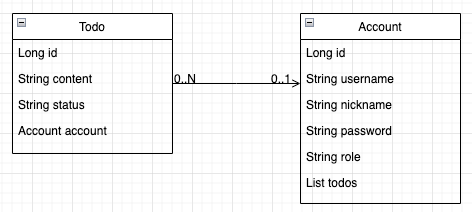
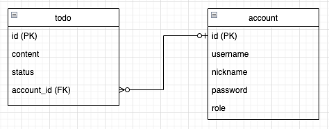
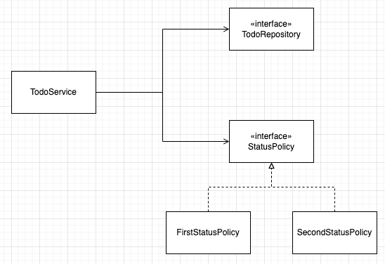
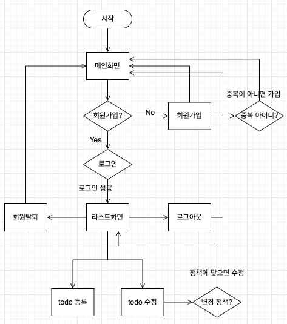

# 미니 프로젝트: TODO List 서비스

* java 11
* Spring Boot 2.7.17
* Gradle
* JPA
* H2(메모리모드)

## 목차

- [코드 실행](#코드-실행)
- [API 문서](#API-문서)
- [코드 구조](#코드-구조)
- [서비스 흐름](#서비스-흐름)

## 코드 실행

* 추가적인 설정 없이 git clone 이후 실행하면 됩니다.
* 메인 화면 URL은 http://localhost:8080 입니다.
* DB는 H2 메모리 모드를 사용하고 있습니다. 회원을 서버 실행과 동시에 저장하지 않고 있어서 등록된 회원이 없습니다.
* 등록된 회원이 없기 때문에 로그인하기 위해서 회원가입을 먼저 해야합니다.

## API 문서

| API 명          | URI    | Method |
|----------------|--------|--------|
| 회원가입           | /account/signup | POST   |
| 회원탈퇴           | /account/delete   | DELETE |
| TODO 생성        | /todo/save   | POST   |
| 회원 TODO 리스트 조회 | /todo/list   | GET    |
| 회원의 가장 최근 TODO 조회 | /todo/latest   | GET    |
| TODO 수정 | /todo/update   | POST    |

> [참고]  
> swagger API 문서: http://localhost:8080/swagger-ui/index.html  
> * 서버 실행 후 위의 url에 접근하면 swagger로 작성한 문서를 볼 수 있습니다.
> * 단, 메모리 DB를 사용하고 있어서 등록된 회원이 없습니다. 접근하기 위해서 회원가입을 먼저 해야합니다.
> * http://localhost:8080 에서 회원가입을 하고 swagger url로 접근해서 로그인하면 됩니다.

## 코드 구조

### 엔티티 클래스

  
한 Accont가 여러개의 Todo를 쓸 수 있도록 설계했습니다.

### ERD

  
Todo와 Account는 다대일 (N:1) 관계이며, Account와 Todo는 일대다 (1:N) 관계입니다.

### 확장 가능한 코드 구조

  
Todo에 대한 코드 구조입니다.  
TodoService는 TodoRepository와 StatusPolicy를 의존하고 있습니다.  
그리고 FirstStatusPolicy 또는 SecondStatusPolicy가 StatusPolicy를 의존하고 있습니다.

## 서비스 흐름

> 메인 화면: http://localhost:8080

  

